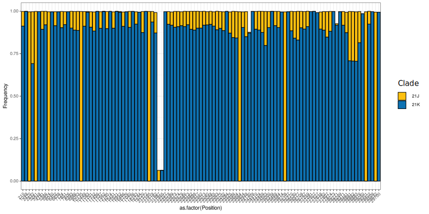
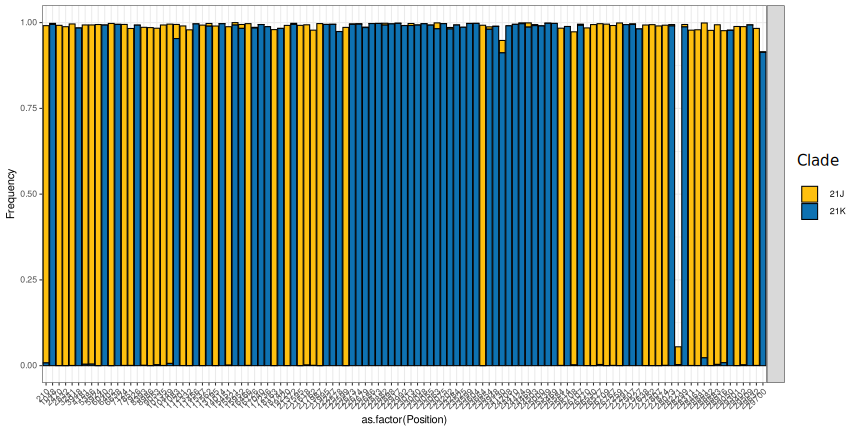

# CovSeqClade


## Introduction

This [Nextflow](https://www.nextflow.io/) workflow takes as input paired-end SARS-CoV-2 fastq files (gz or [dsrc](https://pubmed.ncbi.nlm.nih.gov/24747219/) compressed). It computes the relative coverage on all the mutations that are specific to all Nextclade clades.

For each sample, it is possible to visually check:

1) The probable virus clade
2) Cases of co-infections with several clades
3) Cases of potential recombination between clades

Lineage mutations are taken from [Nextclade data](https://github.com/nextstrain/nextclade_data/), more specifically from the file [virus_properties.json](https://github.com/nextstrain/nextclade_data/blob/master/data/datasets/sars-cov-2/references/MN908947/versions/2022-04-08T12:00:00Z/files/virus_properties.json).

On the output plots presenting all clades, the mutations found on at least one lineage are displayed. Mutations present on at least 2 clades are represented in yellow, and mutations present on a single clade are represented in blue. The height of each bar (yellow or blue) represents the relative coverage on the mutation compared to the total coverage at that position. Mutations at positions covered with <100 reads are displayed with semi-transparent bars.

On the output plots comparing two clades, all positions that differ in the virus_properties.json for the two clades are presented. For example, if a mutation m is defined at position x for clade c1, and nothing is specified at position x for clade c2, then we will compare the relative coverage on m for clade1 and on the reference for clade2. Since clade definitions are not specific to the given samples, it may lead to noise in the representation, with some positions displayed as clade 2 and correspond to the reference.


## Installation

### Dependencies

To run this workflow, you need to install:

1) Java
2) Nextflow
3) Singularity

### Configuration

You should also update the `nextflow.config` to match your HPC plateform configuration.

1) For slurm: You just have to change the variables  `slurmqueue`, `slurmqos`.
2) For running locally: You just have to set the variable `executor='local'`, in the `process`section.
3) For other HPC platforms, have a look at the [nextflow documentation](https://www.nextflow.io/docs/latest/executor.html). 

## Usage

To display workflow help:

```
nextflow run main.nf --help
```

To run the workflow, type:

```
nextflow run main.nf --results <result directory> \
                     --fastqs <input data directory> \
                     --clade1 <First clade to compare|-1> \
                     --clade2 <Second clade to compare|-1>
```

If clade1 or clade2 = -1, then the coverage on all clades are displayed. Otherwise, only clade1 and clade2 are compared.

## Examples

- Co-infection visualized with clade1=-1 and clade2=-1


- Co-infection visualized with clade1=21J and clade2=21K



- Recombination visualized with clade1=-1 and clade2=-1


- Recombination visualized with clade1=21J and clade2=21K


